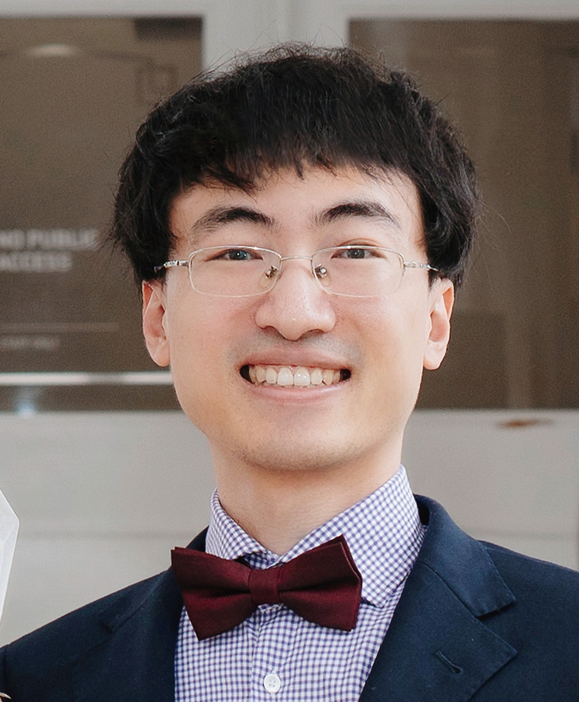

## Welcome to Yiqing Guo's homepage

Copyright 2022 Cheng Soon Ong.

{:style="float: right" width="30%"}

### **About me**

Hi, my name is Yiqing Guo. Currently, I am a Postdoctoral Research Fellow at CSIRO, Australia.

I study remote sensing and machine learning, and apply these exciting techniques to agricultural, ecological
and environmental problems.

I received my bachelor’s and master’s degrees from Beihang University, in
2012 and 2015, respectively, and my PhD degree from the University of New
South Wales, Canberra Campus, in 2019, all in remote sensing.

After one and a half years of industry experience, I joined the
Commonwealth Scientific and Industrial Research Organisation (CSIRO) as a 
CSIRO Early Research Career (CERC) Postdoctoral Research Fellow. My postdoctoral 
research is jointly supported by the Machine Learning and Artificial 
Intelligence Future Science Platform and the Space Technology Future Science 
Platform.

I have authored/co-authored more than 20 peer-reviewed publications. My
first-authored articles have been published in top journals such as ISPRS
P&RS, IEEE TIP, IEEE TGRS, and IEEE GRSM.